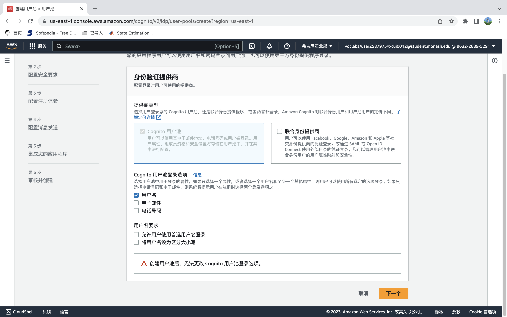
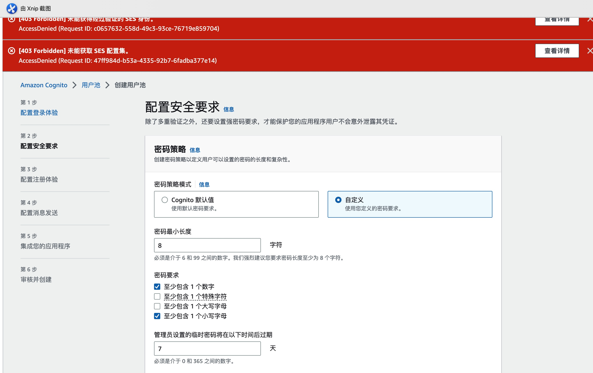
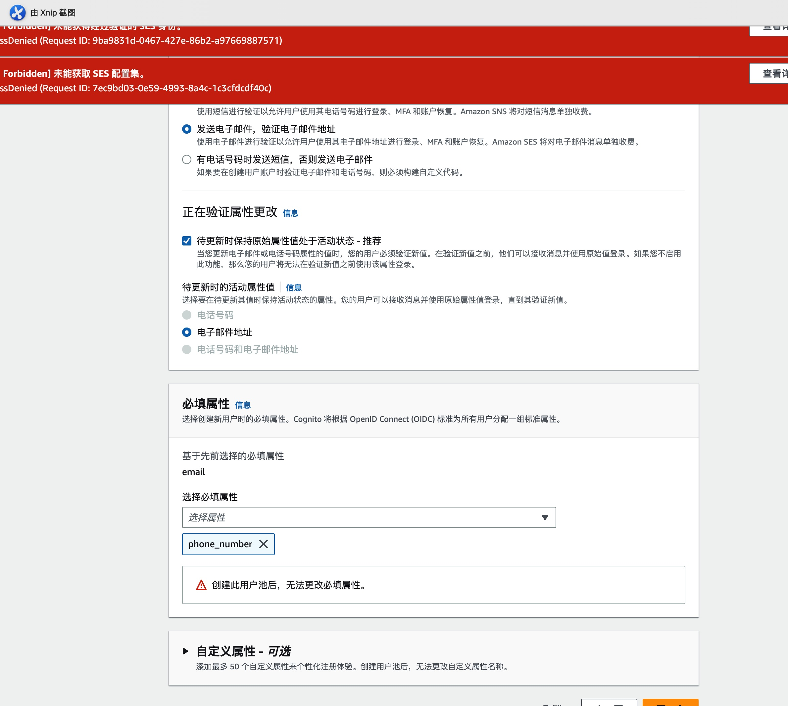
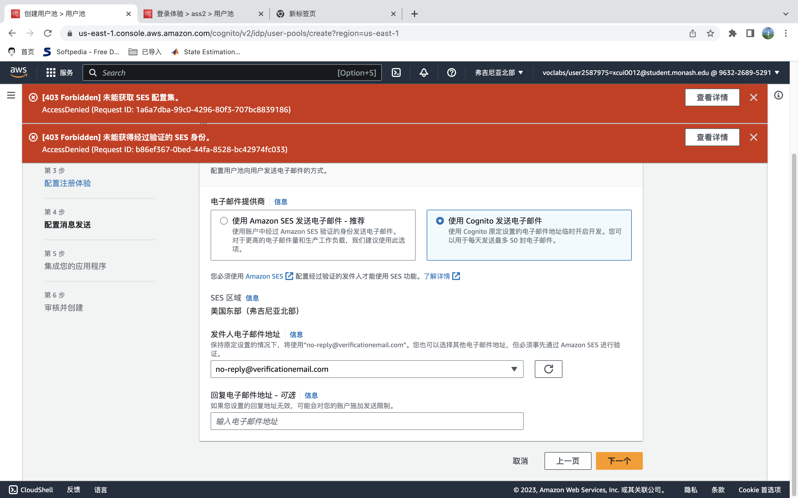
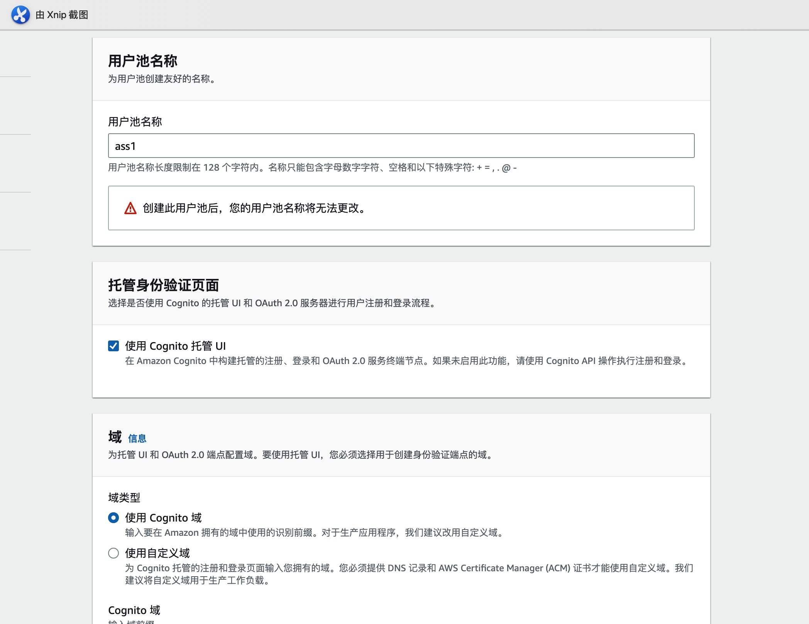
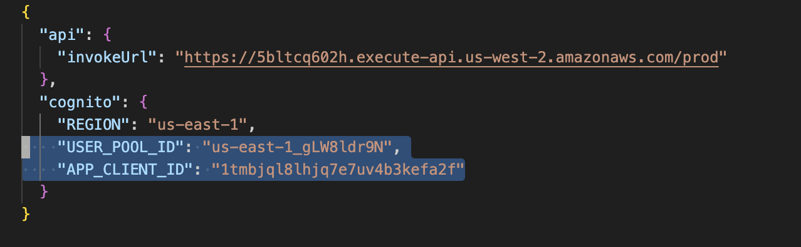
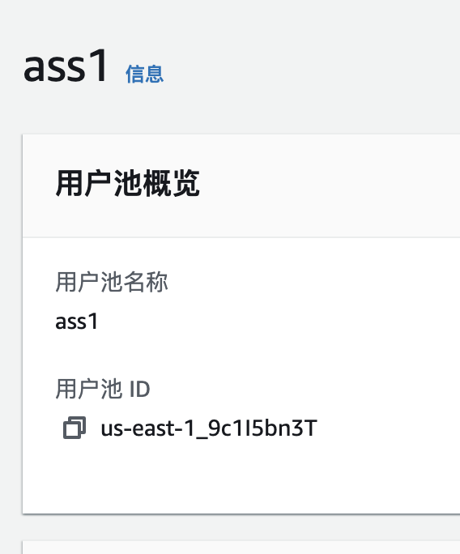
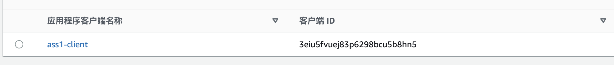
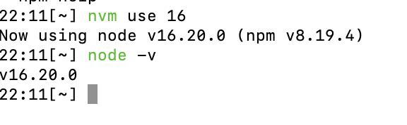

## 配置cognito
可以按如下方式配置cognito登录

在config.json文件中修改
将USER_POOL_ID 和 APP_CLIENT_ID 修改为自己的

## 安装依赖

安装npm 使用node 16版本

1. npm i
2. npm i aws-amplify

## 运行程序

npm run start

## 功能
目前能够完成注册用户，登录用户，注销用户。注册用户后可以在cognito中看到信息